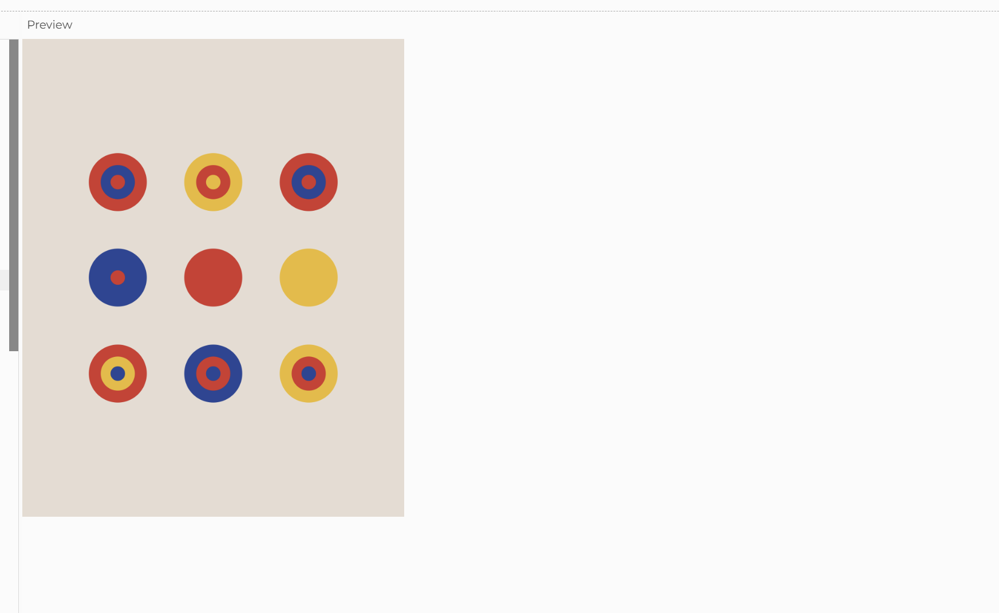
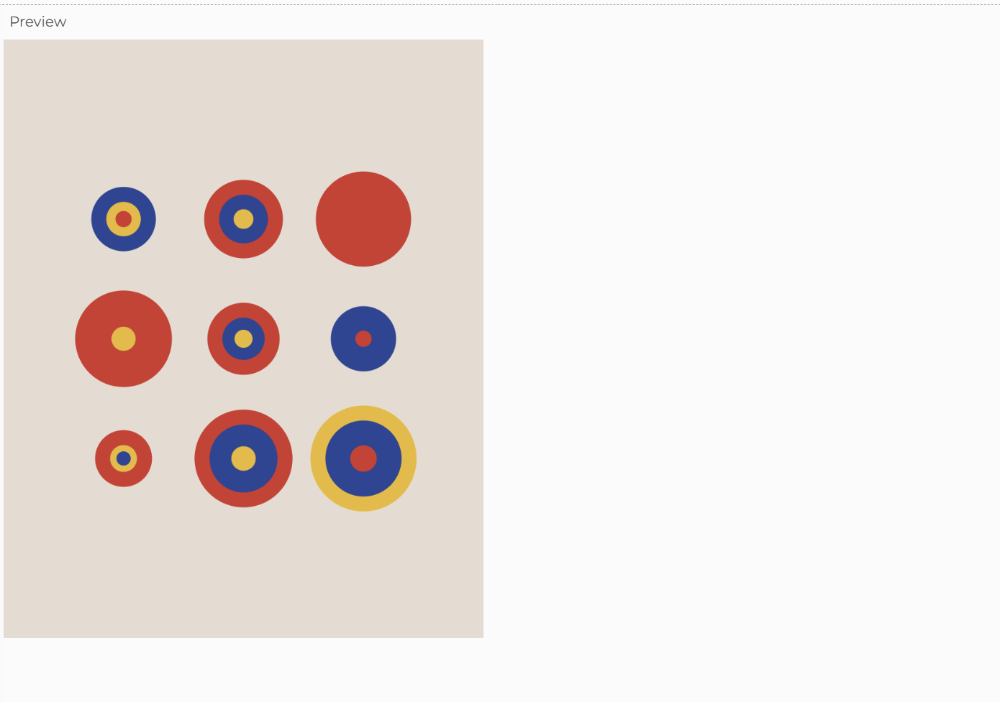
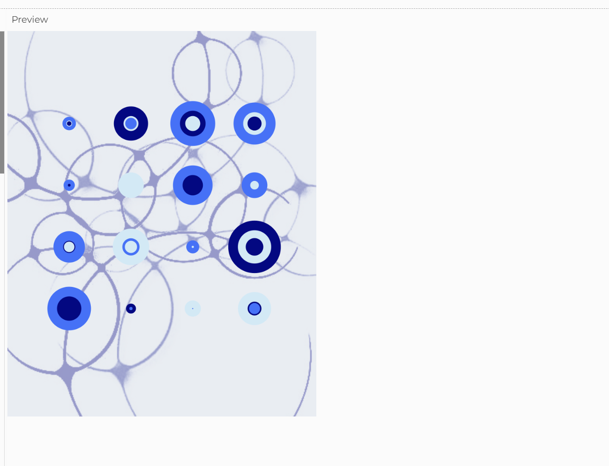
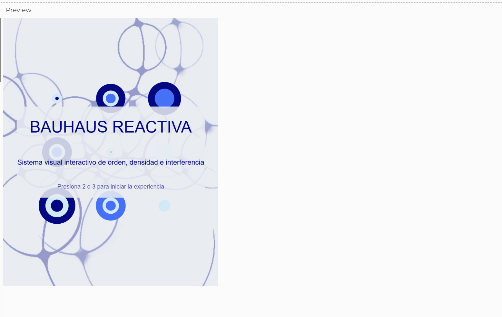

# Examen_Sistema-Bauhaus-Reactivo

**Nombre del proyecto:** Sistema Bauhaus Reactivo

**Autor:** Benjamín Rocco

**Link p5.js:**
[Abrir sketch en p5.js](https://editor.p5js.org/benjamin.rocco/sketches/jDdAW2eUa)

## 1. Descripción

Este proyecto es un sketch interactivo desarrollado en **p5.js**. En pantalla se genera una composición visual formada por módulos geométricos organizados en grillas. Cada módulo está compuesto por tres formas concéntricas que cambian de color, tamaño y forma durante la ejecución del programa.

El sistema tiene **cuatro estados**, activados con las teclas `1`, `2`, `3` y `4`. Los tres primeros estados trabajan con distintas densidades de grilla, mientras que el cuarto funciona como cierre del sistema.

La interacción ocurre a través del mouse, el teclado y el sonido. La posición horizontal del mouse controla el tamaño base de los módulos; al presionar el mouse, las formas cambian de círculos a cuadrados; y la amplitud del sonido modifica el tamaño de los elementos visuales.

El primer estado funciona como entrada del sistema, ya que muestra la grilla ordenada junto a un texto inicial. Al presionar las teclas `2`, `3` o `4`, ese texto desaparece y la experiencia continúa solo con la composición visual.

El resultado es una composición generativa y reactiva, donde la imagen cambia constantemente a partir de reglas programadas, valores aleatorios e inputs del usuario.

## 2. Inputs y outputs

### Inputs interactivos

1. **Movimiento horizontal del mouse (`mouseX`)**
   Controla el tamaño base de los módulos mediante la función `map()`.

2. **Mouse presionado (`mouseIsPressed`)**
   Cambia la forma de los módulos.
   Si el mouse está presionado, los módulos se dibujan como cuadrados.
   Si el mouse no está presionado, los módulos se dibujan como círculos.

3. **Teclado (`keyPressed`)**
   Permite cambiar entre los estados del sistema:

* Tecla `1`: Estado 1, grilla ordenada con entrada inicial.
* Tecla `2`: Estado 2, grilla más densa.
* Tecla `3`: Estado 3, grilla saturada.
* Tecla `4`: Estado 4, cierre del sistema.

### Input sonoro

El archivo de sonido `glitch.mp3` se activa durante la experiencia. El programa mide su amplitud mediante `p5.Amplitude()` y usa ese valor para modificar el tamaño de los módulos.

De esta manera, el sonido no funciona solo como acompañamiento, sino como un dato que influye directamente en el comportamiento visual del sistema.

### Multimedia

**Imagen de fondo (`fondo.jpg`)**
Funciona como una textura visual secundaria que acompaña la composición modular.

**Sonido (`glitch.mp3`)**
Funciona como elemento sonoro y también como fuente de información para modificar la imagen mediante su amplitud.

### Outputs

El sistema genera un output visual dinámico compuesto por:

* Módulos geométricos circulares o cuadrados.
* Cambios de tamaño controlados por el mouse y por la amplitud del sonido.
* Variaciones aleatorias de color mediante `random()`.
* Cuatro estados con funciones distintas dentro de la experiencia.
* Una textura de fondo que refuerza la atmósfera visual.
* Una composición reactiva que cambia constantemente durante la ejecución del programa.

## 3. Sistema

El funcionamiento del sistema se organiza en una estructura de entrada, procesamiento y salida.

Primero, en `preload()`, se cargan los archivos multimedia del proyecto: una imagen de fondo y un sonido. Luego, en `setup()`, se crea el canvas, se define el modo de dibujo de los rectángulos, se configura la alineación del texto y se activa el medidor de amplitud del sonido.

En `draw()`, el programa se actualiza constantemente. La posición horizontal del mouse se transforma en un valor de tamaño mediante `map(mouseX, 0, width, 60, 100)`. Ese valor se limita para que no sea menor a 60 ni mayor a 100. Después, el sistema mide el volumen del audio con `amplitud.getLevel()` y transforma ese valor en una variable llamada `reaccionSonido`, que se suma al tamaño de cada módulo.

Cada estado utiliza bucles `for()` para recorrer posiciones dentro de una grilla. En cada posición se generan colores aleatorios con `random(3)` y se calcula el tamaño final del módulo. Luego se llama a la función `dibujarModulo()`, que decide si dibujar círculos o cuadrados según el estado del mouse.

El sistema también utiliza la variable booleana `mostrarTextoInicio`, que controla si el texto inicial debe aparecer o no. Al comienzo su valor es `true`, por eso el texto aparece en el primer estado. Cuando el usuario presiona `2`, `3` o `4`, esta variable cambia a `false`, haciendo que el texto desaparezca y no vuelva a mostrarse durante la experiencia.

## 4. Estados del sistema

### Estado 1: Entrada / orden

El primer estado presenta una grilla más espaciada y ordenada. Además, incluye un texto inicial con el nombre del proyecto y una breve instrucción para comenzar la experiencia.

Este estado funciona como entrada del sistema, pero mantiene la lógica visual de la grilla original. Cuando el usuario presiona `2`, `3` o `4`, el texto inicial desaparece y no vuelve a aparecer, aunque se regrese al estado 1.

### Estado 2: Densidad

El segundo estado aumenta la cantidad de módulos, reduciendo la distancia entre filas y columnas. Esto genera una sensación de mayor acumulación visual y transición hacia la saturación.

En este estado, el sistema mantiene la interacción con el mouse, el sonido y el azar.

### Estado 3: Saturación

El tercer estado ocupa casi toda la pantalla con una grilla más cerrada. La composición se vuelve más intensa, densa e inestable. Este estado representa el punto de mayor saturación visual del sistema.

El sonido sigue activo en este momento, por lo que la amplitud del audio continúa influyendo en el tamaño de los módulos.

### Estado 4: Cierre

El cuarto estado funciona como cierre limpio del sistema. No interrumpe la grilla saturada del estado 3, sino que aparece después, cuando el usuario decide cerrar la experiencia presionando la tecla `4`.

Este estado permite darle una estructura más clara al recorrido: entrada, desarrollo, saturación y cierre.

## 5. Elementos técnicos utilizados

El proyecto incorpora los siguientes recursos técnicos:

* **Variables propias:** `tamano`, `estado`, `fondo`, `sonido`, `amplitud`, `reaccionSonido`, `mostrarTextoInicio`.
* **Condicionales:** control de tamaño, selección de estado, selección de color, cambio entre círculo y cuadrado, aparición/desaparición del texto inicial.
* **Funciones propias:** `elegirColor()`, `dibujarModulo()` y `textoInicio()`.
* **Bucles:** bucles `for()` anidados para recorrer filas y columnas.
* **`map()`:** transforma la posición horizontal del mouse en un rango de tamaño.
* **`random()`:** genera variación de color y tamaño.
* **Input interactivo:** mouse, teclado y sonido.
* **Output visual dinámico:** grilla modular reactiva.
* **Cuatro estados:** entrada, densidad, saturación y cierre.
* **Multimedia:** imagen de fondo y sonido.

## 6. Marco conceptual

El proyecto toma como punto de partida la **Bauhaus**, principalmente por su uso de formas geométricas simples, grilla, color y composición modular. Esta referencia ya estaba presente en mi Solemne II, donde trabajé con una composición basada en círculos, repetición y variaciones cromáticas.

Para el examen, retomé esa base visual con el objetivo de transformarla en un sistema más interactivo. La composición deja de funcionar como una imagen fija y pasa a responder al usuario mediante el mouse, el teclado y el sonido. De esta manera, la lógica modular inspirada en la Bauhaus se adapta al lenguaje de la programación creativa.

El sistema trabaja entre el orden y la interferencia. La grilla organiza la composición, mientras que `random()`, la amplitud del sonido y los cambios de estado introducen variaciones que modifican el resultado visual en tiempo real. Así, las formas geométricas dejan de ser elementos estáticos y se convierten en módulos reactivos.

La estructura de estados también refuerza esta idea: el sistema inicia desde una composición ordenada, avanza hacia una mayor densidad, llega a una saturación visual y finalmente se cierra.

## 7. Referente principal

*Bauhaus / Solemne II* [https://editor.p5js.org/benjamin.rocco/sketches/U-lbY0VQc]

.jpg)

El referente principal del proyecto es la **Bauhaus**, entendida desde su relación con la geometría, la síntesis formal y la organización visual mediante estructuras modulares. Me interesó tomar esta referencia porque permite construir una composición clara a partir de elementos básicos como círculos, cuadrados, color y repetición.

También tomo como referencia directa mi proyecto de **Solemne II**, ya que este examen funciona como una evolución de esa primera exploración. En la versión anterior, el sistema tenía una interacción más limitada; en esta nueva versión busqué mejorar su comportamiento, incorporando estados, reacción al sonido, cambios de forma, texto inicial y un cierre.

La propuesta no busca copiar literalmente la Bauhaus, sino reinterpretarla desde un contexto digital. Por eso, el proyecto mantiene una base geométrica y modular, pero la vuelve dinámica, reactiva y audiovisual.

## 8. Decisiones visuales y sonoras

La paleta de color utiliza tonos azules, celestes y azul profundo. Estos colores buscan dar una sensación de modernidad, actualidad y lenguaje digital. Aunque el proyecto parte desde una referencia histórica como la Bauhaus, la paleta permite actualizar esa influencia hacia una estética más contemporánea.

Los módulos están construidos con tres capas concéntricas, lo que permite mantener una identidad visual clara en los distintos estados. A medida que el sistema cambia, varían la densidad, el tamaño, el color y la forma, pero se conserva una estructura reconocible.

El fondo funciona como una textura secundaria que introduce interferencia visual. Esta capa tensiona la limpieza geométrica de la grilla y refuerza la idea de un sistema que no permanece completamente estable.

El sonido también participa en el comportamiento visual. Su amplitud modifica el tamaño de los módulos, generando una relación directa entre audio e imagen. Esto permite que el proyecto no dependa solo de la interacción manual, sino también de una respuesta audiovisual.

El texto inicial fue incorporado solo como entrada del sistema. Luego desaparece para no ensuciar la composición visual. De esta forma, el proyecto mantiene una pantalla de inicio, pero conserva la limpieza de las grillas durante la experiencia principal.

## 9. Reflexión final

El desarrollo de este proyecto me permitió transformar una exploración visual que ya había iniciado en mi Solemne II en un sistema interactivo más completo. Al comienzo, la composición funcionaba principalmente desde la repetición de módulos geométricos, pero durante el proceso fui incorporando nuevas capas de interacción que modifican su comportamiento en tiempo real.

Una de las decisiones más importantes fue no abandonar la lógica visual inicial, sino adaptarla mejor al lenguaje de la programación. La grilla, los círculos y los cuadrados se mantuvieron como base del proyecto, pero dejaron de operar como elementos estáticos. A través del uso de `map()`, `random()`, condicionales, bucles y funciones propias, la composición comenzó a responder al mouse, al teclado y al sonido.

También fue importante ajustar el equilibrio entre control y variación. En varias etapas, el sistema podía volverse demasiado caótico o perder legibilidad, especialmente por el uso de `random()` y por la reacción del sonido. Por eso fui modificando los rangos de tamaño y la intensidad de la amplitud sonora hasta encontrar un punto medio donde la composición se sintiera dinámica, pero todavía clara y coherente.

La incorporación del texto inicial permitió darle una entrada más clara al sistema sin abandonar la grilla original. Para que este texto no interfiriera con la experiencia visual, utilicé una variable booleana llamada `mostrarTextoInicio`, que permite mostrarlo solo al comienzo y ocultarlo después de iniciar la interacción.

El sonido fue una incorporación clave, porque permitió que el proyecto no dependiera solo de la interacción manual. Al medir la amplitud del audio y usarla para modificar el tamaño de los módulos, el sistema adquirió una dimensión audiovisual más evidente.

El estado 4 funciona como un cierre simple del sistema. No reemplaza la saturación del estado 3, sino que aparece después como una pausa final. Esto permite que la experiencia tenga una estructura más completa: entrada, densidad, saturación y cierre.

Durante el proceso también comprendí mejor la estructura interna de un programa interactivo, la diferencia entre inputs, procesos y outputs; la función de los estados; el uso de condicionales booleanos; y la importancia de ordenar el código para poder explicarlo.

El resultado final busca mostrar una evolución entre orden, densidad, saturación y cierre. A partir de una base geométrica inspirada en la Bauhaus, el proyecto propone una composición reactiva que cambia según la acción del usuario, el azar y el sonido. Esta experiencia me ayudó a entender que programar no es solo escribir código, sino construir reglas visuales capaces de producir comportamiento, variación y sentido.

## 10. Diagrama de flujo

.png)

## 11. Proceso visual

### Primera versión

.png)

### Primera versión con variación

### Segunda versión

### Versión final

